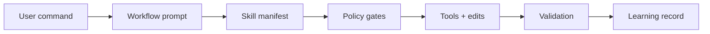
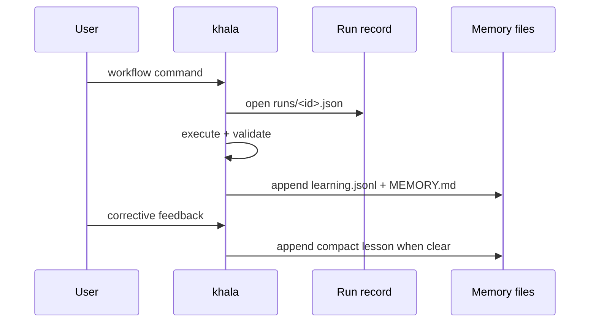

<div align="center">

# khala

**A guarded, self-learning Pi coding-agent runtime for pragmatic engineering work.**

<p>
  <a href="./LICENSE"></a>
  
  
</p>

</div>

---

## What khala adds

<table>
  <tr>
    <td><strong>Workflow commands</strong></td>
    <td>Debugging, review, simplification, planning, TDD, issue triage, shipping, and skill creation.</td>
  </tr>
  <tr>
    <td><strong>Safety gates</strong></td>
    <td>Risk approval, preflight/postflight evidence, blocked destructive commands, and response compliance.</td>
  </tr>
  <tr>
    <td><strong>Local-first learning</strong></td>
    <td>File-backed workflow observations and corrective lessons; no model fine-tuning or transcript storage.</td>
  </tr>
  <tr>
    <td><strong>Bundled tooling</strong></td>
    <td>Pi extensions for fast search (<code>@ff-labs/pi-fff</code>) and subagent workflows (<code>pi-subagents</code>).</td>
  </tr>
</table>

> [!IMPORTANT]
> khala favors minimal, reversible changes. High-risk operations require explicit checker approval.

## Quick start

```bash
pi install https://github.com/pesap/agents
pi
```

Inside Pi:

```text
/khala
```

Run once without installing:

```bash
pi -e https://github.com/pesap/agents -p "/khala"
```

## Core flow



## Commands

### Agent and policy control

| Command | Purpose |
| --- | --- |
| `/khala` | Initialize khala and set compliance mode to `warn` for the session. |
| `/khala status\|strict\|enforce\|warn\|monitor\|reset` | Report or change compliance mode. |
| `/end-agent` | Disable khala session context injection. |
| `/approve-risk <reason> [--ttl MINUTES]` | Approve one high-risk command. TTL defaults to 20 minutes and is capped to 1–120 minutes. |
| `/preflight Preflight: skill=<name\|none> reason="<short>" clarify=<yes\|no>` | Record manual mutation intent. |
| `/postflight Postflight: verify="<command_or_check>" result=<pass\|fail\|not-run>` | Record verification evidence. |

### Workflow commands

These are registered and enabled by default unless `runtime/profile.yaml` disables them or their prompt/spec files fail validation.

| Command | Purpose |
| --- | --- |
| `/debug <problem> [--fix]` | Investigate a failure and optionally apply the smallest safe fix. |
| `/feature <request> [--ship]` | Deliver a scoped feature with tests/docs planning. |
| `/review [scope] [--extra "focus"]` | Review changes by scope: uncommitted, branch, commit, PR, folder, file, or paths. |
| `/git-review` | Run git-history diagnostics before reading code. |
| `/simplify [scope] [--extra "focus"]` | Behavior-preserving simplification and slop cleanup. |
| `/ship [extra instruction]` | Simplify, validate, commit, push, and open/confirm PR/MR. Uses GitButler target selection. |
| `/plan <plan_or_topic>` | Stress-test a plan and capture terms/ADRs when needed. |
| `/triage-issue <problem_statement>` | Investigate a bug and prepare a TDD fix plan/PR. |
| `/tdd <goal> [--lang auto\|python\|rust\|c]` | Run strict red-green-refactor delivery. |
| `/address-open-issues [--limit N] [--repo owner/repo]` | Sweep open GitHub issues authored by the current user. |
| `/learn-skill <topic> [--from <path\|url>] [--dry-run]` | Create or refine a reusable skill in the learning store. |

<details>
<summary><strong>Run workflows outside the REPL</strong></summary>

```bash
pi -e https://github.com/pesap/agents -p "/review README.md --extra 'focus on correctness'"
pi -e https://github.com/pesap/agents -p "/simplify src/commands/review.ts"
pi -e https://github.com/pesap/agents -p "/ship"
pi -e https://github.com/pesap/agents -p "/tdd 'Add retry policy for hook loading' --lang rust"
```

</details>

## Runtime behavior

When khala is enabled (`/khala` or any khala workflow command):

<ul>
  <li><code>bash</code> calls are policy-checked.</li>
  <li>Risky/destructive commands may be blocked unless approved.</li>
  <li>Direct Python package/runtime commands are steered to <code>uv</code>.</li>
  <li>Workflow commands create auto-preflight records.</li>
  <li>Mutation workflows are checked for postflight evidence.</li>
  <li>Final workflow responses are checked for <code>Result: success|partial|failed</code> and <code>Confidence: &lt;0..1&gt;</code> when response compliance is enabled.</li>
</ul>

Blocked/steered command families include `pip`, `pip3`, `poetry`, `python -m pip`, `python -m venv`, `python -m py_compile`, and path-qualified Python executables. Intercepted `python`/`python3` route through `uv run`.

> [!NOTE]
> Local version-control write operations are expected to use GitButler (`but`). Workflows start from `but status -fv` and run `but setup --status-after` when setup is missing.

## Configuration and package layout

```text
.
├── commands/      # user-facing workflow prompts
├── workflows/     # workflow specs queued into Pi messages
├── skills/        # packaged reusable skills
├── extensions/    # Pi extension implementation
├── runtime/       # profile, compliance, hooks, and bootstrap docs
└── scripts/       # lightweight guard/regression checks
```

### Runtime config

| Path | Purpose |
| --- | --- |
| `runtime/profile.yaml` | Workflow enablement, prompt/spec names, low-confidence threshold, and first-principles defaults. |
| `runtime/compliance/first-principles-gate.yaml` | Persistent compliance gate defaults. |
| `runtime/hooks/hooks.yaml` | Lifecycle hook configuration. Hook markdown paths are constrained to `runtime/hooks/`. |
| `runtime/hooks/bootstrap.md` / `runtime/hooks/teardown.md` | Default session start/end hook docs. |

### Workflow prompts and specs

Workflow prompt frontmatter can list `skills:`. By default, khala injects a skill manifest only: skill name, description, and `skills/<name>/SKILL.md` path. Full skill bodies are injected only when a prompt/spec sets `skillContext: full`; `skillContext: none` disables skill context. Missing required skills stop the workflow before it is queued.

### Skills and learned skills

Package-registered skills come from `package.json` Pi config:

- `./skills`
- `./node_modules/pi-subagents/skills`

Packaged skills include `librarian`, copied from `https://github.com/mitsuhiko/agent-stuff/tree/main/skills/librarian`. When a prompt includes a GitHub repo URL or `owner/repo` shorthand, khala should load `librarian` and cache the repo before inspecting it.

`/learn-skill` writes learning artifacts to the khala learning store, not to package `skills/`, and does not automatically add them to package manifests or workflow skill frontmatter.

## Learning model

Learning is event-based memory, not model fine-tuning.



Durable artifacts are written to:

- Preferred: `<repo>/.pi/khala/` when `.pi/` exists in cwd
- Fallback: `~/.pi/khala/`

| File | Purpose |
| --- | --- |
| `memory/learning.jsonl` | Structured observations per workflow run. |
| `memory/lessons.jsonl` | Passive lessons inferred from corrective normal prompts. |
| `memory/MEMORY.md` | Concise chronological learnings. |
| `memory/promotion-queue.md` | Promotion/improvement hints from repeated outcomes. |
| `runs/*.json` | Per-run workflow records. |
| `skills/<name>/SKILL.md` | Skills created by `/learn-skill`. |

<details>
<summary><strong>What is enforced vs not enforced</strong></summary>

**Enforced** in configurable warn/enforce modes:

- preflight before mutation tools (`edit`, `write`, mutating `bash`)
- postflight evidence after mutation
- workflow response footer lines: `Result: ...` and `Confidence: 0..1`

**Not automatic:**

- no automatic edits to `README.md`, `INSTRUCTIONS.md`, or skills from learning
- no model training/fine-tuning
- no raw transcript or full tool-output storage for passive normal-chat learning

</details>

## Compliance modes

```text
/khala enforce   # strict mode
/khala warn      # warnings only
/khala reset     # configured defaults
```

Persistent defaults live in `runtime/compliance/first-principles-gate.yaml`.

Expected strict behavior:

- Missing preflight before first mutation (`edit`/`write`/mutating `bash`) → mutation is blocked with remediation text.
- Missing postflight evidence after mutation → workflow is marked failed at completion.
- Missing final `Result:` / `Confidence:` lines in workflow output → response is blocked until fixed.

## Design goals

1. One canonical agent identity.
2. Learn from user feedback and workflow outcomes.
3. Stay concise/token-efficient by default.
4. Prefer transparent file-backed learning (`learning.jsonl`, `lessons.jsonl`, `MEMORY.md`).
5. Enable safe self-improvement with explicit guardrails.
